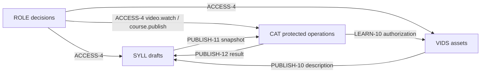

<!-- SPDX-License-Identifier: Apache-2.0 -->
<!-- SPDX-FileCopyrightText: 2026 SubLang International <https://sublang.ai> -->

# Course Website Spec Map

This index is navigation only; normative truth lives in cited items.
See [Writing Strong Spex Specs](../guidelines.md) for authoring guidance and [META](meta.md) for the format.

## Product

The product is a minimal video-course website with a public published catalog, GitHub-only membership, private video playback, and one configured initial administrator.
The administrator authors ordered syllabi, uploads videos, and publishes immutable releases; anyone may browse published releases, while members may watch entitled private videos.
[DR-000](decisions/000-minimal-course-scope.md) fixes scope and exclusions.

## Layout

```text
decisions/     Durable choices and rationale
iterations/    Incremental implementation plans and acceptance targets
packages/      Standalone package contracts
compositions/  Installed bindings, integrated scenarios, and verification
map.md         This index
meta.md        Format rules
```

Subdirectories inside `packages/` and `compositions/` are collections only ([META-2](meta.md#meta-2)).

## Decisions

| Record | Choice |
| --- | --- |
| [DR-000](decisions/000-minimal-course-scope.md) | public published catalog, private playback, one configured administrator, draft/release lifecycle, and direct browser-playable video |
| [DR-001](decisions/001-web-platform.md) | Next.js/TypeScript/Tailwind/shadcn, Vercel, Supabase, GitHub delivery, trust policy, and environment profiles |
| [DR-002](decisions/002-course-media-boundary.md) | separate mutable syllabus, immutable catalog release, and video contracts |

## Iterations

| Record | Vertical slice |
| --- | --- |
| [IR-001](iterations/001-foundation-and-entry.md) | delivery foundation, runtime isolation, GitHub identity, access policy, and application shell |
| [IR-002](iterations/002-author-and-publish.md) | administrator draft, resumable video upload, immutable publication, and bootstrap acceptance |
| [IR-003](iterations/003-browse-watch-and-ship.md) | public discovery, private playback, security hardening, and protected production delivery |

## Packages

| Package | Owns | Reuse scope |
| --- | --- | --- |
| [GHID](packages/access/github-identity.md) | GitHub identity, accounts, and sessions | applications offering a GitHub identity path |
| [ROLE](packages/access/role-access.md) | member/administrator policy and protected course capabilities | course sites using the same two-role policy |
| [SYLL](packages/learning/course-syllabus.md) | mutable drafts and immutable publication snapshots | authoring systems with compatible content and publication collaborators |
| [VIDS](packages/media/video-library.md) | Supabase video upload, lifecycle, and private playback | Supabase applications accepting the stated media contract |
| [CAT](packages/learning/course-catalog.md) | public immutable releases, catalog selection, and lesson entitlement | public course-delivery systems using the same snapshot semantics |
| [SITE](packages/web/application-shell.md) | this website's routes, navigation, states, and accessibility | project-local |
| [LIVE](packages/operations/production-runtime.md) | environment readiness, isolation, and service continuity | compatible Vercel–Supabase applications |
| [PIPE](packages/operations/github-delivery.md) | review gates, previews, promotion evidence, and rollback | the declared GitHub–Next.js–Vercel–Supabase delivery stack |

Each package defines its own meanings, cites no peer Internal Behavior, and contains no Binding or Scenario citation.
An intentional fixed dependency may cite exact peer External Behavior; selectable suppliers remain composition Bindings.
`VIDS` is still reusable even though it is intentionally Supabase-specific; `SITE` honestly declares itself project-local.

## Installed bindings

Bindings install External assembly roles or select suppliers for package Internal requirements without modifying either package.

| Home | Installed seams |
| --- | --- |
| [ENTRY](compositions/access/enter-site.md#binding) | GHID visible sign-in states → SITE login and protected-entry roles |
| [ACCESS](compositions/access/install-course-access.md) | GHID → ROLE, SITE → GHID destination, GHID + ROLE → protected SITE surfaces, ROLE → SYLL/CAT protected operations/VIDS, ROLE → LIVE readiness |
| [PLAT](compositions/operations/install-platform.md) | production and fixture identity authorities, Postgres, Storage, runtime, and delivery control planes |
| [PUBLISH](compositions/authoring/publish-course.md#binding) | VIDS → SYLL description, SYLL → CAT snapshot, CAT → SYLL result |
| [LEARN](compositions/learning/browse-and-watch.md#binding) | CAT current-lesson authorization → VIDS playback authorization |
| [SHIP](compositions/operations/deliver-change.md#binding) | PIPE attestation/candidate → LIVE and LIVE evidence → PIPE |

The important course/media cycle is:



These arrows are installed semantic bindings, not source imports.
For example, [SYLL-13](packages/learning/course-syllabus.md#syll-13) defines the content description it needs without naming VIDS; [PUBLISH-10](compositions/authoring/publish-course.md#publish-10) selects [VIDS-10](packages/media/video-library.md#vids-10) as this installation's supplier.

`ACCESS-4` also demonstrates that Binding items are not one-to-one: one ROLE policy supplies three client packages and four protected capability meanings; public catalog reads require no role grant.
`PLAT-1` and `PLAT-2` bind the same GHID requirement to different authorities in disjoint production and test scopes.

## Scenarios and acceptance

| Composition | Integrated outcome | Verification |
| --- | --- | --- |
| [ENTRY](compositions/access/enter-site.md) | GitHub-only entry, safe return, cancellation, and re-entry | ENTRY-20–22 |
| [BOOT](compositions/access/bootstrap-admin.md) | deterministic initial administrator and fail-closed readiness | BOOT-20–21 |
| [PUBLISH](compositions/authoring/publish-course.md) | draft + ready videos become one coherent release | PUBLISH-20–24 |
| [LEARN](compositions/learning/browse-and-watch.md) | public-catalog-to-private-play journey, renewal, recovery, and reuse | LEARN-20–24 |
| [GUARD](compositions/security/protect-course-content.md) | public catalog, protected route, data, storage, stale-entitlement, and sign-out boundaries | GUARD-20–24 |
| [SHIP](compositions/operations/deliver-change.md) | fixture preview, staged promotion, rollback, and real-provider smoke | SHIP-20–24 |

`ACCESS` and `PLAT` are binding-only because their seams are cross-cutting.
`ENTRY`, `PUBLISH`, `LEARN`, and `SHIP` mix Binding and Scenario because each binding directly serves the same file's outcome.
`BOOT` and `GUARD` are scenario-only and cite shared bindings inline at the handoffs they exercise.

All 31 Scenario items have acceptance coverage.
All 19 Binding items have audience-appropriate coverage in their authoritative files.
The eight packages retain 27 local Verification items for validation matrices, private invariants, races, replay, and provider boundaries.

The traces are complementary:

```text
package Behavior -> inline package Verification citation -> contract evidence
package External or materially relevant Internal Behavior -> inline Scenario citation -> Scenario -> inline Verification citation -> acceptance evidence
supplier External Behavior -> Binding -> External client role
supplier External Behavior or selected service -> Binding -> package Internal requirement
Binding -> inline Scenario citation -> Scenario
Binding -> inline Verification citation -> conformance evidence
```

## External and internal behavior

[SYLL-2](packages/learning/course-syllabus.md#syll-2) is External Behavior for an author who sees save results.
[SYLL-11](packages/learning/course-syllabus.md#syll-11) is also External Behavior: an installed publisher may rely on the snapshot.
[SYLL-13](packages/learning/course-syllabus.md#syll-13) is Internal Behavior: SYLL requires a provider-neutral content description, and only a Binding may select its supplier.
[SYLL-10](packages/learning/course-syllabus.md#syll-10) is also Internal Behavior, but it is a private invariant rather than a consumed requirement.

A peer package may rely on only another package's External Behavior.
A Binding may cite Internal Behavior only as a client, while its supplier side cites External Behavior.
Assembly Bindings join External roles, as [ENTRY-10](compositions/access/enter-site.md#entry-10) does.
A Scenario may cite Internal Behavior when materially needed for an integrated outcome or inspection, but that citation does not expose it.
An installed package overlay can show those reverse links, but it is derived and never written into the package file ([META-23](meta.md#meta-23)).

## Requirement coverage

| Requested requirement | Owning specs | Integrated proof |
| --- | --- | --- |
| minimal online course website | [DR-000](decisions/000-minimal-course-scope.md), SYLL, CAT, VIDS, SITE | PUBLISH, LEARN, GUARD |
| GitHub login only | [DR-001](decisions/001-web-platform.md), [PLAT-1](compositions/operations/install-platform.md#plat-1), GHID | ENTRY, SHIP |
| initial administrator authors syllabi and uploads video | ROLE, SYLL, VIDS | BOOT, PUBLISH |
| visitors browse published courses; members view private videos | GHID, CAT, VIDS | ENTRY, LEARN, GUARD |
| Next.js App Router + TypeScript + Tailwind + shadcn/ui | [DR-001](decisions/001-web-platform.md), SITE | ENTRY, LEARN, SHIP |
| Vercel + Supabase Auth/Postgres/Storage | [DR-001](decisions/001-web-platform.md), [PLAT](compositions/operations/install-platform.md), LIVE, PIPE | GUARD, SHIP |
| DevOps on GitHub | PIPE, [PLAT-6](compositions/operations/install-platform.md#plat-6) | SHIP |

## Code-generation readiness

The specs fix actors, routes, states, limits, ordering, trust sources, lifecycle and conflict rules, installed seams, platform scopes, visible failure behavior, and acceptance evidence.
Implementation may now vary source structure and replaceable code dependencies without inventing product policy or cross-package wiring.
