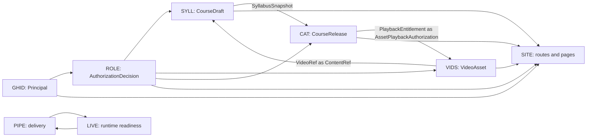

<!-- SPDX-License-Identifier: Apache-2.0 -->
<!-- SPDX-FileCopyrightText: 2026 SubLang International <https://sublang.ai> -->

# Course Website Spec Map

This is the navigation and traceability index for the specification-only course website demo.
Normative truth lives in cited decision, package, and composition items.

## Product

The product is a private, minimal video-course website with GitHub-only membership and one configured initial administrator.
The administrator authors ordered syllabi, uploads videos, and publishes immutable releases; authenticated members browse releases and watch their entitled private videos.
Scope and exclusions are fixed in [DR-000](decisions/000-minimal-course-scope.md).

## Layout

```text
decisions/     Durable choices and rationale
packages/      Self-contained package contracts
compositions/  Cross-package scenarios and acceptance verification
map.md         This index
meta.md        Proposed format rules
```

Subdirectories inside `packages/` and `compositions/` are collections only.
For example, moving `packages/media/video-library.md` under another collection would change navigation and citation paths, but not package meaning, ownership, or visibility ([META-2](meta.md#meta-2)).

## Decisions

| Record | Choice |
| --- | --- |
| [DR-000](decisions/000-minimal-course-scope.md) | private minimal scope, one configured admin, draft/release lifecycle, direct browser-playable video, explicit exclusions |
| [DR-001](decisions/001-web-platform.md) | Next.js/TypeScript/Tailwind/shadcn, Vercel, Supabase Auth/Postgres/Storage, trust/access matrix, fixture previews, staged production delivery |
| [DR-002](decisions/002-course-media-boundary.md) | mutable syllabus, immutable catalog release, and video asset remain separate reusable contracts |

## Package contracts

| Package | Human language | Owns | Main provided contract | Main required contract | Portability |
| --- | --- | --- | --- | --- | --- |
| [GHID](packages/access/github-identity.md) | visitor/member sign-in and session | GitHub account, identity mapping, active session | `IdentityView`, trusted `Principal`/`DataAccessIdentity`, `SessionState` | verified GitHub Auth user/session, safe destination | public candidate |
| [ROLE](packages/access/role-access.md) | member/admin access and denial | bootstrap binding and capabilities | `RoleView`, `DataRoleProjection`, server-only `AuthorizationDecision` | trusted `Principal`/`DataAccessIdentity`, configured subject, capability request | public candidate |
| [SYLL](packages/learning/course-syllabus.md) | administrator syllabus editor | mutable ordered draft and snapshot | draft views/results, publication candidate with immutable `SyllabusSnapshot` | author context, trusted `ContentDescriptor`, publication result | public candidate |
| [VIDS](packages/media/video-library.md) | upload and entitled playback | exact upload capability and private asset lifecycle | video/upload/playback views, `ContentDescriptor`, `VideoRef`, `PlaybackGrant` | manage context, generic asset authorization, availability observation | public candidate |
| [CAT](packages/learning/course-catalog.md) | publish, browse, course detail | immutable releases and current catalog | catalog views, publication result, request-scoped entitlement | publish/consume decisions, data-role projection, trusted snapshot | public candidate |
| [SITE](packages/web/application-shell.md) | routes, navigation, page states | product route and layout language | safe destination, shell/unavailable views | exact package-owned views/results | project-local |
| [LIVE](packages/operations/production-runtime.md) | operator readiness | environment profiles, credential inventory, readiness | readiness, smoke target/result, service revisions/compatibility | deployment/configuration records, provider health, role readiness | template candidate |
| [PIPE](packages/operations/github-delivery.md) | pull request, preview, promote, rollback | delivery evidence, mutations, and gates | checks, fixture/candidate/deployment records, evidence/rollback decision | commit, migrations/config, readiness/smoke/revision results | template candidate |

## Concrete bindings

The course/media cycle is intentional and semantic, not a source dependency cycle:



- [PUBLISH-1](compositions/authoring/publish-course.md#publish-1) binds a ready `VideoRef`/`ContentDescriptor` into a lesson `ContentRef`, then supplies the complete `SyllabusSnapshot` to the catalog.
- [LEARN-1](compositions/learning/browse-and-watch.md#learn-1) maps a fresh opaque current-release entitlement to VIDS's course-agnostic asset authorization for one request.
- Neither `SYLL` nor `VIDS` needs the other's domain vocabulary; the cross-package outcome is visible only in those compositions.

The `Composes:` line on each scenario cites only user-visible External Behavior.
The separate `Binds:` mapping list cites stable package Binding items such as [CAT-0](packages/learning/course-catalog.md#cat-0) and [VIDS-0](packages/media/video-library.md#vids-0), so the real collaborator handoff is traceable without making [CAT-13](packages/learning/course-catalog.md#cat-13) or [VIDS-11](packages/media/video-library.md#vids-11) part of another package's contract.

## Compositions and acceptance

| Composition | Integrated outcome | Acceptance items |
| --- | --- | --- |
| [ENTRY](compositions/access/enter-site.md) | GitHub-only entry, safe return, cancellation and session-expiry recovery | ENTRY-20, ENTRY-21 |
| [BOOT](compositions/access/bootstrap-admin.md) | deterministic initial administrator and fail-closed bootstrap | BOOT-20, BOOT-21 |
| [PUBLISH](compositions/authoring/publish-course.md) | ordered draft + ready videos become one coherent release, including conflicts and integrated accessibility | PUBLISH-20–PUBLISH-23 |
| [LEARN](compositions/learning/browse-and-watch.md) | full entry-to-play journey, private renewal/recovery, reuse, and integrated accessibility | LEARN-20–LEARN-23 |
| [GUARD](compositions/security/protect-course-content.md) | routes, direct data/storage access, stale entitlement, and sign-out cannot bypass the protection chain | GUARD-20–GUARD-24 |
| [SHIP](compositions/operations/deliver-change.md) | fixture preview, verified staged candidate, safe promotion/rollback, and real-provider smoke | SHIP-20–SHIP-23 |

Each scenario has a `Composes:` edge to at least two package External Behavior items and a `Binds:` edge to the participating package Binding contracts.
Each acceptance item has a `Verifies:` edge to its scenario, producing the visible trace:

```text
package External Behavior -> composition scenario -> acceptance item -> future CI evidence
```

The six composition files contain 31 integrated scenarios and 21 acceptance items.
All 31 scenarios are cited by acceptance verification.
The eight packages retain 27 package-local verification items for validation matrices, trust-boundary attacks, and hidden invariants that should not leak into acceptance scenarios.

Compositions intentionally cover most, not all, verification.
They cover complete journeys, cross-package consistency, denials, recovery, accessibility in real integrated controls, direct data/storage attacks, and deployed operation.
Package Verification retains cases such as canonical GitHub subject parsing, draft revision arithmetic, release idempotence, upload finalization races, cache isolation, and delivery evidence reconciliation because those do not require another package to fail correctly.

## Reuse inside this project

One package is referenced from multiple outcomes without copying its requirements:

| Package | Referencing compositions |
| --- | --- |
| GHID | ENTRY, BOOT, LEARN, GUARD, SHIP |
| ROLE | ENTRY, BOOT, PUBLISH, LEARN, GUARD, SHIP |
| SYLL | PUBLISH, LEARN, GUARD |
| VIDS | PUBLISH, LEARN, GUARD |
| CAT | ENTRY, PUBLISH, LEARN, GUARD, SHIP |
| SITE | ENTRY, BOOT, PUBLISH, LEARN, GUARD, SHIP |
| LIVE | BOOT, SHIP |
| PIPE | SHIP |

[LEARN-2](compositions/learning/browse-and-watch.md#learn-2) also uses one `VIDS` asset instance in two `SYLL` lesson positions through the same `VideoRef`, demonstrating data-level reuse without duplicating the package or asset.
[PUBLISH-1](compositions/authoring/publish-course.md#publish-1), [PUBLISH-3](compositions/authoring/publish-course.md#publish-3), and [LEARN-2](compositions/learning/browse-and-watch.md#learn-2) also reference the same `SYLL`, `CAT`, and `VIDS` contracts multiple times for first publication, republishing, and reused video without copying package requirements.
The same package behavior set is exercised against deterministic local providers and the production provider binding declared by [DR-001](decisions/001-web-platform.md); received configuration and test adapters vary, while package contracts do not.

## Binding contract and hidden behavior

[VIDS](packages/media/video-library.md) is a concrete self-contained boundary: it names every human user, owns upload attempts/assets/grants/player outcomes, receives management authorization, a provider-neutral data-role projection, a generic request-scoped asset authorization, and trusted storage-availability observations, provides reusable descriptors/references/views/grants, explicitly excludes course structure and progress, and verifies all of its external and hidden behavior locally.
Nothing outside `VIDS` needs to know how [VIDS-10](packages/media/video-library.md#vids-10) validates readiness, how [VIDS-15](packages/media/video-library.md#vids-15) makes finalization idempotent, or how cleanup is organized.

That hiding is enforceable rather than stylistic: [META-17](meta.md#meta-17) forbids packages from citing another package's Internal Behavior.
For example, `CAT` provides the request-scoped entitlement meaning at [CAT-0](packages/learning/course-catalog.md#cat-0); the host maps it to the course-agnostic authorization received by [VIDS-0](packages/media/video-library.md#vids-0); and [LEARN-3](compositions/learning/browse-and-watch.md#learn-3) records the binding.
The hidden entitlement recomputation and grant-consumption rules can change independently as long as those two binding contracts and the visible scenario remain true.

## Requirement coverage

| Requested requirement | Owning specs | Integrated acceptance |
| --- | --- | --- |
| minimal online course website | [DR-000](decisions/000-minimal-course-scope.md), [SYLL](packages/learning/course-syllabus.md), [CAT](packages/learning/course-catalog.md), [VIDS](packages/media/video-library.md), [SITE](packages/web/application-shell.md) | PUBLISH, LEARN, GUARD |
| GitHub login only | [GHID-1](packages/access/github-identity.md#ghid-1), [GHID-12](packages/access/github-identity.md#ghid-12), [LIVE-11](packages/operations/production-runtime.md#live-11) | ENTRY, GUARD, SHIP |
| initial admin authors syllabus and uploads video | [ROLE-1](packages/access/role-access.md#role-1), [SYLL-1](packages/learning/course-syllabus.md#syll-1)–[SYLL-5](packages/learning/course-syllabus.md#syll-5), [VIDS-1](packages/media/video-library.md#vids-1)–[VIDS-3](packages/media/video-library.md#vids-3) | BOOT, PUBLISH |
| users log in and view courses/videos | [GHID](packages/access/github-identity.md), [CAT-1](packages/learning/course-catalog.md#cat-1), [CAT-2](packages/learning/course-catalog.md#cat-2), [VIDS-4](packages/media/video-library.md#vids-4) | ENTRY, LEARN, GUARD |
| Next.js App Router + TypeScript + Tailwind + shadcn/ui | [DR-001](decisions/001-web-platform.md), [SITE](packages/web/application-shell.md) | ENTRY, LEARN, SHIP |
| Vercel + Supabase Auth/Postgres/Storage | [DR-001](decisions/001-web-platform.md), [LIVE](packages/operations/production-runtime.md), provider-specific hidden behavior in GHID, ROLE, SYLL, CAT, VIDS, and SITE | BOOT, GUARD, SHIP |
| DevOps on GitHub | [PIPE](packages/operations/github-delivery.md) | SHIP |

## Code-generation readiness

The demo fixes the actors, role bootstrap and drift rule, scope exclusions, routes, draft and release models, slug behavior/conflicts, media profiles and lifecycle, semantic package inputs/outputs, identity/session/entitlement provenance, data-access matrix, cache and signed-URL limits, provider placement, fixture/production profiles, CI/CD mutation gates, visible failure behavior, and acceptance evidence.
An implementation plan may now divide work by package and use compositions as integration milestones without inventing product behavior.
No iteration records are included because implementation ordering was not requested and is temporary planning rather than product truth.
