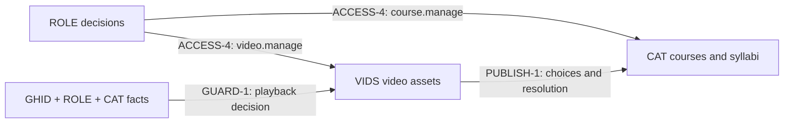

<!-- SPDX-License-Identifier: Apache-2.0 -->
<!-- SPDX-FileCopyrightText: 2026 SubLang International <https://sublang.ai> -->

# Course Website Spec Map

This file is navigation only; normative truth lives in the cited items.
See [Writing Strong Spex Specs](../guidelines.md) for authoring guidance and [META](meta.md) for the format.

## Product

The product is a minimal course website with a public published catalog, GitHub-only membership, private video playback, and one configured administrator.
The administrator maintains each course and its ordered syllabus as one mutable record; a save to a published course becomes public immediately and atomically.
Videos have an independent lifecycle, interrupted uploads retry from byte zero, and an issued bearer has at most five minutes of residue after sign-out or a course-policy change; deleting a video removes its origin content.
[DR-000](decisions/000-minimal-course-scope.md) fixes the scope and exclusions.

## Layout

```text
decisions/     Durable choices and rationale
iterations/    Incremental implementation plans and acceptance targets
packages/      Standalone package contracts
compositions/  Installed bindings, integrated scenarios, and verification
map.md         This index
meta.md        Format rules
```

Subdirectories inside `packages/` and `compositions/` are collections only ([META-2](meta.md#meta-2)).

## Decisions

| Record | Choice |
| --- | --- |
| [DR-000](decisions/000-minimal-course-scope.md) | public dual-order catalog, private playback, mutable courses, hard deletion, byte-zero upload retry, and bounded bearer residue |
| [DR-001](decisions/001-web-platform.md) | Next.js, Tailwind, shadcn/ui, Vercel, Supabase, GitHub delivery, trust policy, and environment profiles |
| [DR-002](decisions/002-course-media-boundary.md) | CAT owns course structure and references; VIDS owns independent assets; compositions install their seams |
| [DR-003](decisions/003-admin-designation.md) | one configured stable GitHub subject designates the administrator, with no first-user claim or role-management UI |

## Iterations

| Record | Vertical slice |
| --- | --- |
| [IR-001](iterations/001-foundation-and-entry.md) | delivery foundation, runtime isolation, safe GitHub identity, access policy, and application shell |
| [IR-002](iterations/002-author-and-publish.md) | mutable course authoring, byte-zero video upload, publication, deletion, and configured-admin acceptance |
| [IR-003](iterations/003-browse-watch-and-ship.md) | public discovery, private playback, bounded authorization residue, security hardening, and protected delivery |

## Packages

| Package | Owns | Reuse scope |
| --- | --- | --- |
| [GHID](packages/access/github-identity.md) | GitHub accounts, sessions, sign-in, sign-out, and safe return | applications accepting its GitHub identity contract |
| [ROLE](packages/access/role-access.md) | configured administrator/member assignment and three course-site capabilities | sites using the same two-role policy |
| [CAT](packages/learning/course-catalog.md) | mutable courses, ordered syllabi, stable routes, publication, hard deletion, and opaque media references | course systems with compatible authorization and media collaborators |
| [VIDS](packages/media/video-library.md) | independent private video assets, upload, management, reusable references, and playback grants | hosts with compatible authorizers and private object service |
| [SITE](packages/web/application-shell.md) | this website's routes, navigation, states, caching, and accessibility | intentionally project-local |
| [LIVE](packages/operations/production-runtime.md) | environment readiness, isolation, durable-service continuity, and evidence | compatible Vercel–Supabase applications |
| [PIPE](packages/operations/github-delivery.md) | GitHub review gates, previews, promotion evidence, and rollback | the declared GitHub–Next.js–Vercel–Supabase delivery stack |

All seven files are self-contained contracts and cite no peer package.
External Behavior is what any package user—a person, host, or another package—may observe or rely on; Internal Behavior remains hidden from every outside user.
For example, [CAT-7](packages/learning/course-catalog.md#cat-7) is a public timing promise and [CAT-13](packages/learning/course-catalog.md#cat-13) is a server-only host contract; both are External.
[CAT-15](packages/learning/course-catalog.md#cat-15) and [CAT-16](packages/learning/course-catalog.md#cat-16) are consumed collaborator requirements, and [CAT-17](packages/learning/course-catalog.md#cat-17) is a private invariant.

## Installed bindings

Bindings record static installation choices; package files remain unchanged and reusable.
The demo has 16 Binding items:

| Composition | Binding items | Installed seams |
| --- | ---: | --- |
| [ENTRY](compositions/access/enter-site.md#binding) | 1 | GHID sign-in and results occupy SITE's visible entry roles |
| [ACCESS](compositions/access/install-course-access.md) | 4 | GHID supplies ROLE identity; SITE supplies safe destinations; GHID and ROLE protect SITE; ROLE supplies CAT and VIDS management decisions |
| [PLAT](compositions/operations/install-platform.md) | 6 | production and fixture identity authorities, private Storage, Vercel runtime, GitHub delivery control planes, and Supabase durable services |
| [PUBLISH](compositions/authoring/publish-course.md#binding) | 1 | VIDS chooser entries and reference resolution satisfy CAT's media inputs |
| [GUARD](compositions/security/protect-course-content.md#binding) | 1 | current GHID, ROLE, and CAT facts supply VIDS playback authorization |
| [SHIP](compositions/operations/deliver-change.md#binding) | 3 | PIPE and LIVE exchange provider attestation, candidate identity, readiness, smoke, and compatibility evidence |

`BOOT` and `LEARN` contain no Binding; they use already-installed seams.
`ACCESS` and `PLAT` are binding-only because their cross-cutting selections do not belong to one journey.
The four mixed files keep a Binding beside Scenarios only when those same-file journeys directly exercise or justify it.

The central product wiring is:



CAT stores only an opaque reference and never owns the asset.
VIDS can serve another host unchanged, and one VIDS reference can be used by multiple CAT lessons ([LEARN-2](compositions/learning/browse-and-watch.md#learn-2)).

## Scenarios and acceptance

The demo has 28 Scenario items, each cited by same-file Verification:

| Composition | Shape | Scenario items | Integrated outcome |
| --- | --- | ---: | --- |
| [ENTRY](compositions/access/enter-site.md) | mixed | 4 | public browsing, GitHub entry, failures, same-site return, and re-entry |
| [BOOT](compositions/access/bootstrap-admin.md) | scenario-only | 2 | the configured subject reaches course creation; every other subject remains a member |
| [PUBLISH](compositions/authoring/publish-course.md) | mixed | 6 | create and publish, byte-zero retry, live edits, independent deletion, repair, and accessible authoring |
| [LEARN](compositions/learning/browse-and-watch.md) | scenario-only | 5 | public browse-to-private-play, reference reuse, renewal, unavailable media, and accessible learning |
| [GUARD](compositions/security/protect-course-content.md) | mixed | 5 | public metadata, protected management and storage, sign-out, and bounded bearer residue |
| [SHIP](compositions/operations/deliver-change.md) | mixed | 6 | fixture preview, protected promotion, failure isolation, rollback, and real-provider smoke |

`BOOT` verifies product behavior, not an operator-facing bootstrap-readiness report.
`ACCESS` and `PLAT` have no Scenario; their Verification inspects installation conformance.

## Requirement coverage

| Requested requirement | Owning specs | Integrated proof |
| --- | --- | --- |
| minimal online course website | [DR-000](decisions/000-minimal-course-scope.md), CAT, VIDS, SITE | PUBLISH, LEARN, GUARD |
| public catalog with `Newest` and `Title A–Z` | [CAT-1](packages/learning/course-catalog.md#cat-1) | LEARN, SHIP |
| GitHub login only with safe return | [DR-001](decisions/001-web-platform.md), GHID, SITE | ENTRY, ACCESS, SHIP |
| configured administrator authors syllabi and uploads videos | [DR-003](decisions/003-admin-designation.md), ROLE, CAT, VIDS | BOOT, PUBLISH |
| private playback with bounded bearer residue | CAT, VIDS | LEARN, GUARD |
| Next.js App Router + TypeScript + Tailwind + shadcn/ui | [DR-001](decisions/001-web-platform.md), SITE | ENTRY, LEARN, SHIP |
| Vercel + Supabase Auth/Postgres/Storage | [DR-001](decisions/001-web-platform.md), PLAT, LIVE, PIPE | GUARD, SHIP |
| DevOps on GitHub | PIPE, [PLAT-5](compositions/operations/install-platform.md#plat-5) | SHIP |

## Code-generation readiness

The specs fix actors, routes, states, limits, both catalog orders, authorization timing, deletion ownership, upload retry, cache freshness, installed seams, platform scopes, failure behavior, and acceptance evidence.
Implementation may vary source structure and replaceable code dependencies without inventing product policy or cross-package wiring.
